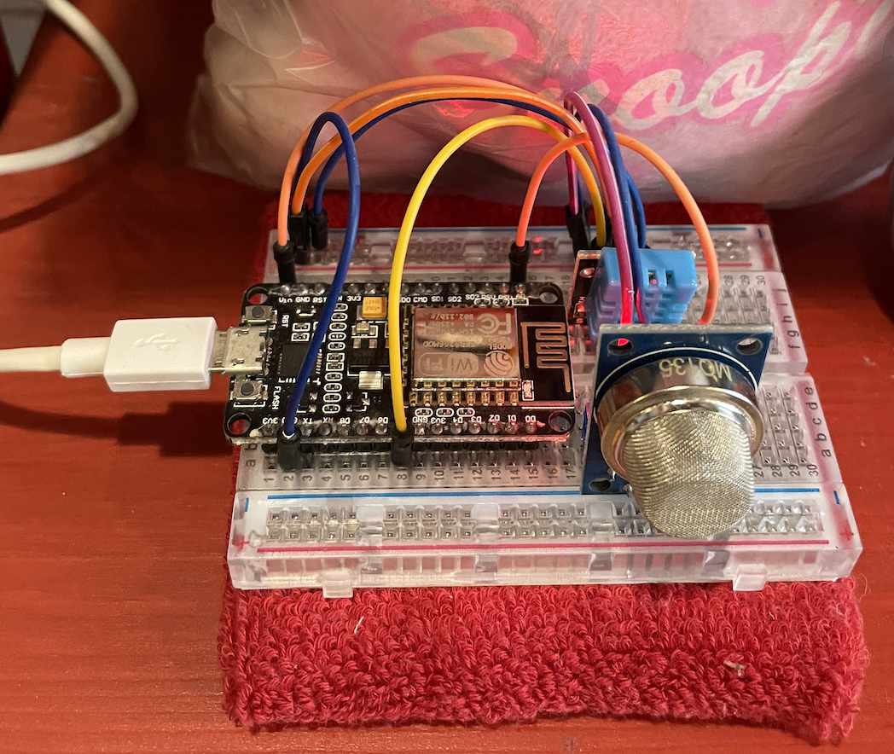
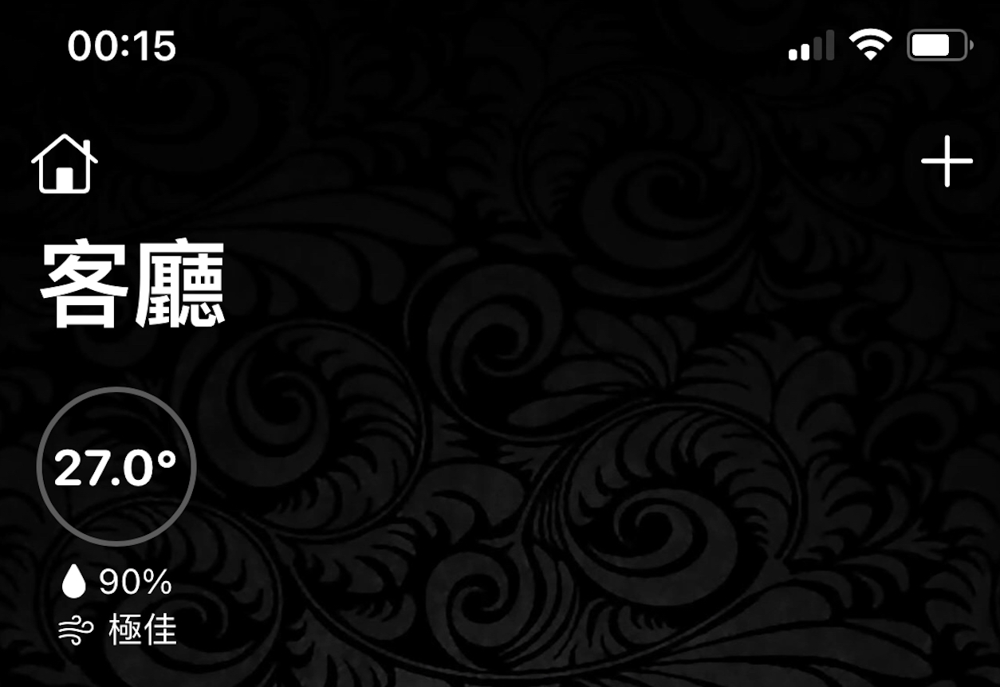
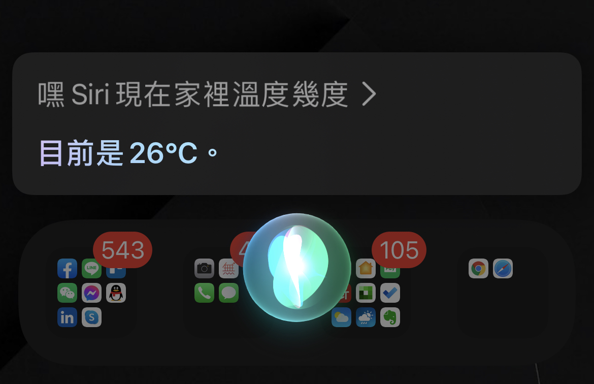

<p align="center"><h1>NodeMCU HomeKit 室內溫濕度 + 空氣品質計</h1></p>

<p align="center"><h3>NodeMCU 實際接線圖 (DHT11 + MQ135)</h3></p>
<p align="left"></p>

<p align="center"><h3>在家庭 App 中顯示</h3></p>
<p align="left"></p>

<p align="center"><h3>透過 Siri 查詢</h3></p>
<p align="left"></p>
<br/>

## 編輯 wifi 設定<br/>
打開 TemperatureSensor/wifi_info.h，修改以下兩行:<br/>
```
const char *ssid = "your-wifi-ssid";
const char *password = "your-wifi-password";
```
<br/>

## 主要檔案結構<br/>
```
TemperatureSensor/
    TemperatureSensor.ino   ---> ESP8266 Arduino 主檔，感測器接收/送出數據都在這裡跑
    my_accessory.c          ---> HomeKit 裝置定義
    wifi_info.h             ---> wifi 設定
```
<br/>

## 引用程式庫<br/>
https://github.com/Mixiaoxiao/Arduino-HomeKit-ESP8266
<br/>

## HomeKit 定義參考<br/>
https://github.com/Mixiaoxiao/Arduino-HomeKit-ESP8266/blob/master/src/homekit/characteristics.h
<br/>
